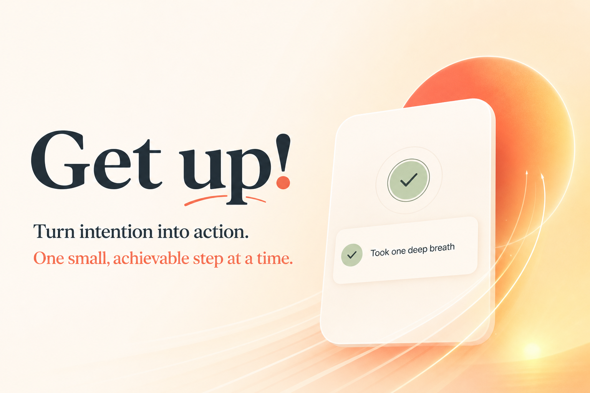
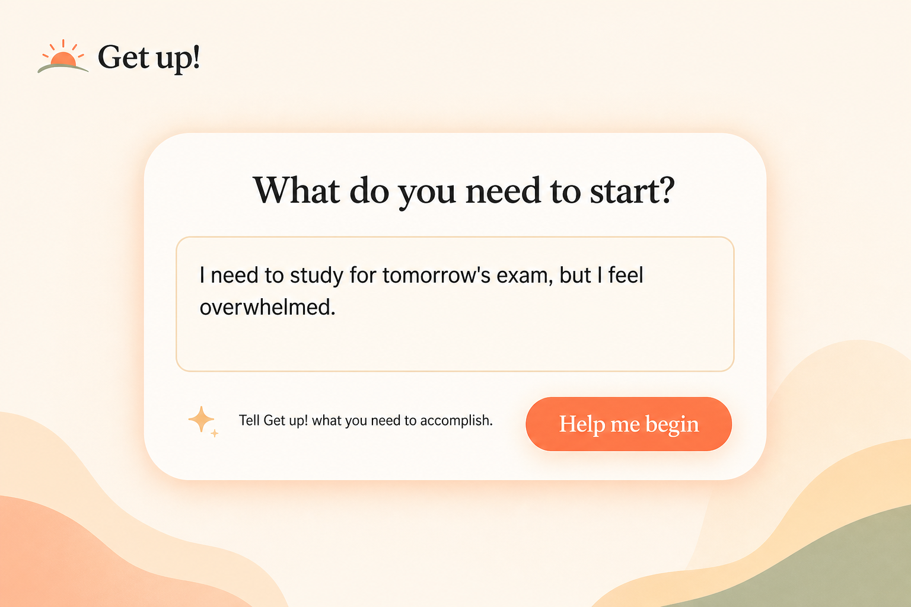
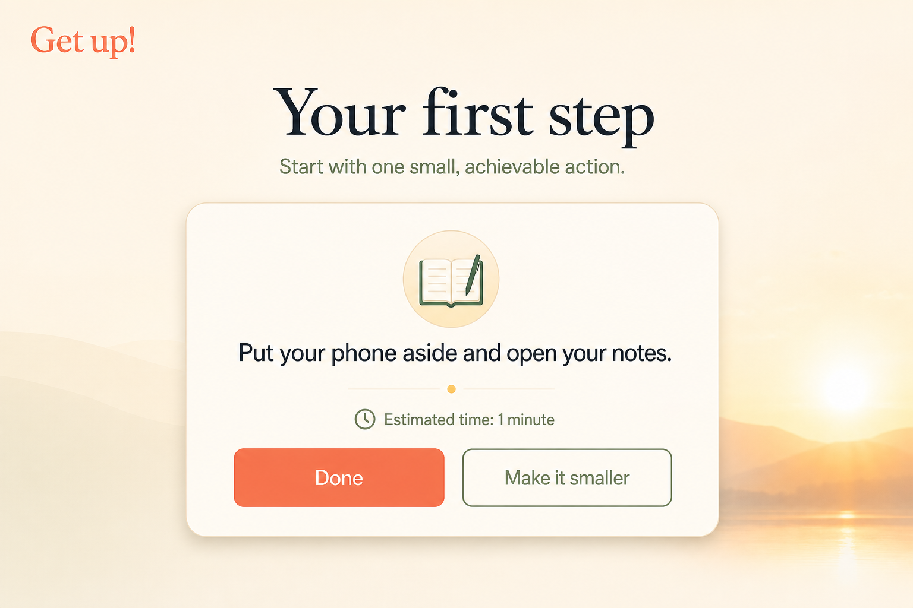
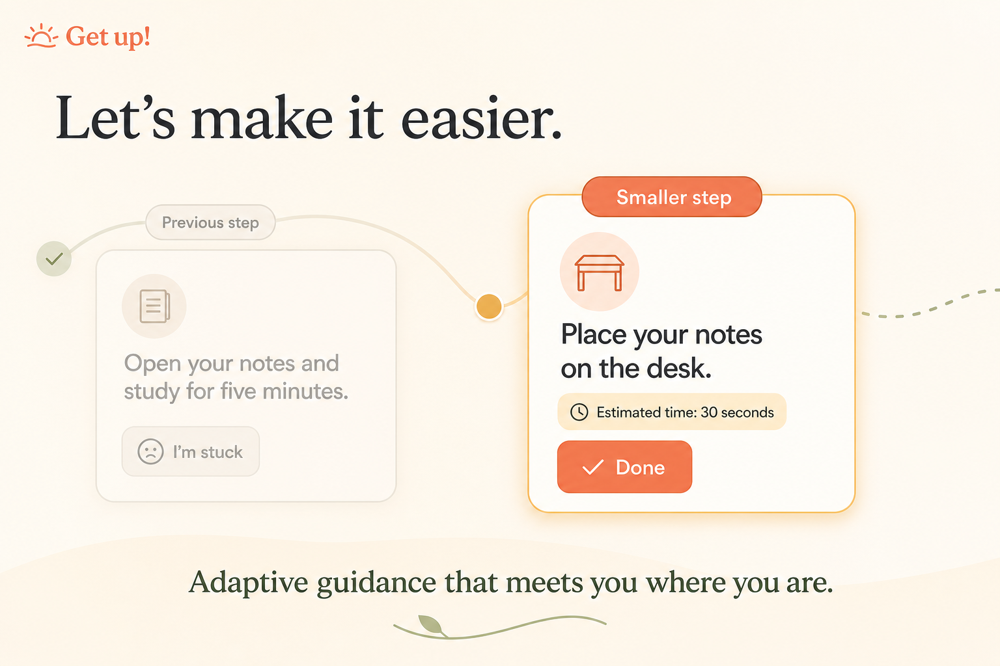
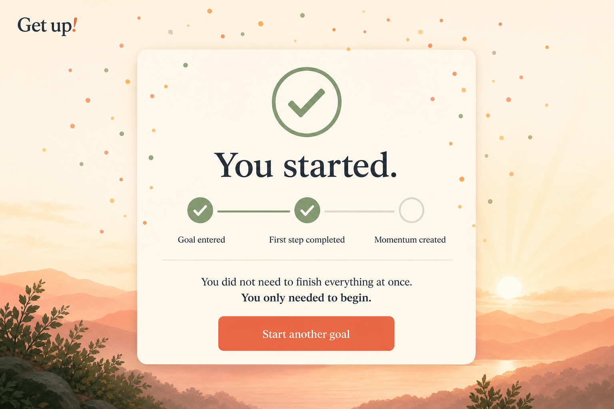

# Get up!

**Turn intention into action.**

Get up! is an action coach that turns an overwhelming goal into one small, immediately achievable action. It focuses on the moment before productivity begins: taking the first step. The public app works in free demo mode without credentials and automatically enables AI-personalized guidance when an OpenAI API key is configured.



## What it does

- Accepts a goal in natural language.
- Generates one concrete first action instead of a long plan.
- Provides the next step after the user clicks **Done**.
- Makes an action substantially smaller when the user clicks **Make it smaller**.
- Keeps the interaction supportive, concise, and focused on progress.
- Falls back to a transparent, rule-based demo mode when no API key is available.

## Built with

- OpenAI Responses API
- Codex
- Python
- Streamlit

## How Codex and GPT-5.6 were used

Codex was the primary development environment for Get up! during OpenAI Build Week. Working with GPT-5.6 in Codex, we turned the initial product idea into a focused interaction contract, implemented the Streamlit session flow, refined the structured JSON response format, hardened model output before rendering it as HTML, added automated interaction tests, and deployed the finished app.

GPT-5.6 was especially useful for the product decisions that make the experience intentionally small: returning exactly one observable action, reducing a step when the user is stuck, and avoiding judgmental or overwhelming language. Codex also helped us design the dual-mode architecture:

- With `OPENAI_API_KEY`, `generate_action` uses the OpenAI Responses API and asks GPT-5.6 for a structured, personalized next step.
- Without credentials, the public deployment uses an explicitly labeled deterministic demo mode so every judge can test the complete interaction without a paid account.

The primary Codex `/feedback` Session ID is supplied in the Devpost submission, and the Git commit history shows the implementation and deployment work completed during the submission period.

## Run locally

1. Create and activate a Python virtual environment.
2. Install the dependencies:

   ```bash
   pip install -r requirements.txt
   ```

3. Optionally set an API key for AI-personalized guidance. Never commit it:

   ```bash
   export OPENAI_API_KEY="your-key-here"
   ```

4. Start the app:

   ```bash
   streamlit run app.py
   ```

Without a key, the app runs in free demo mode. The default API model is `gpt-5.6-luna`; to select another supported model, set `OPENAI_MODEL` in your environment or Streamlit Secrets.

## Deploy on Streamlit Community Cloud

1. Fork or clone this repository to your GitHub account.
2. Create a Streamlit Community Cloud app using `app.py` as the entry point.
3. Deploy immediately for free demo mode, or optionally add these Streamlit Secrets for AI-personalized guidance:

   ```toml
   OPENAI_API_KEY = "your-key-here"
   OPENAI_MODEL = "gpt-5.6-luna"
   ```

4. Deploy and test the public URL in a private browser window.

## Safety and privacy

- API credentials are read only from environment variables or Streamlit Secrets.
- Demo mode sends no goal text to an external AI service.
- The repository ignores local secret files.
- Get up! is a productivity aid, not a medical product or emergency service.
- The prototype does not persist user goals to a database.

## OpenAI Build Week

Get up! was created for OpenAI Build Week as an experiment in using Codex and GPT-5.6 to reduce the friction between intention and action.

## Concept gallery

The images below are concept mockups for the Build Week project page. Replace them with screenshots from the deployed application when possible.





